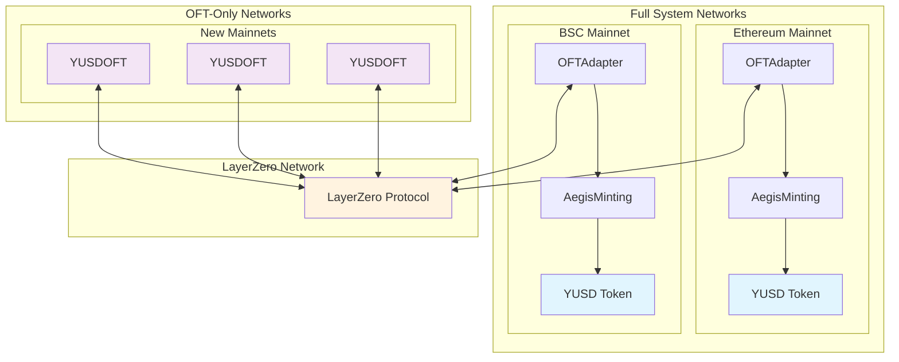

# Aegis Cross-Chain YUSD System Deployment Guide

## 🌟 Overview

Aegis is a comprehensive DeFi system featuring cross-chain YUSD token transfers powered by LayerZero V2. The system enables seamless token bridging between multiple testnets with a simplified security architecture where AegisMinting serves as the sole minter and cross-chain operations are handled directly through role-based access control.

## 🏗 Architecture

### Core Components

- **YUSD Token**: Main ERC-20 token with minting/burning capabilities
- **AegisConfig**: Configuration management contract
- **AegisOracle**: Price oracle for asset valuation
- **AegisRewards**: Rewards distribution system
- **AegisMinting**: Core minting and redeeming logic with cross-chain functions
- **YUSDMintBurnOFTAdapter**: LayerZero OFT adapter that directly integrates with AegisMinting for cross-chain transfers

### Cross-Chain Architecture Flow

```
LayerZero OFT ↔ AegisMinting ↔ YUSD Token
```

**Key Features:**
- **AegisMinting** is the sole minter of YUSD tokens with integrated cross-chain capabilities
- **Direct Integration**: OFT adapter calls AegisMinting's cross-chain functions directly
- Cross-chain operations use dedicated functions: `mintForCrossChain()` and `burnForCrossChain()`
- Role-based access control with `CROSS_CHAIN_OPERATOR_ROLE`
- Emergency pause mechanism specifically for cross-chain operations

## 🌐 Network Architecture

### Network Types & Components

The Aegis ecosystem uses two distinct deployment architectures based on network importance and user base:

#### **Full System Networks** (High Volume)
Networks with complete Aegis infrastructure including minting, rewards, and advanced features:

**Mainnet:**
- **Ethereum Mainnet** - Complete Aegis system + YUSDMintBurnOFTAdapter
- **BSC Mainnet** - Complete Aegis system + YUSDMintBurnOFTAdapter

**Testnet:**
- **Ethereum Sepolia** - Complete Aegis system + YUSDMintBurnOFTAdapter
- **BSC Testnet** - Complete Aegis system + YUSDMintBurnOFTAdapter  
- **Avalanche Fuji** - Complete Aegis system + YUSDMintBurnOFTAdapter

#### **OFT-Only Networks** (Expansion)
Networks with simplified YUSD presence for broader ecosystem reach:

**Mainnet:**
- **All new mainnet deployments** - YUSDOFT contract only

**Testnet:**
- **Optimism Sepolia** - YUSDOFT contract only
- **All new testnet deployments** - YUSDOFT contract only

### Network Interaction Diagram



### Architecture Benefits

**Full System Networks:**
- ✅ Native minting and burning capabilities
- ✅ Rewards distribution system
- ✅ Advanced DeFi integrations
- ✅ Direct asset backing and collateral management
- ✅ Oracle price feeds and governance

**OFT-Only Networks:**
- ✅ Simplified deployment and maintenance
- ✅ Lower gas costs for cross-chain transfers
- ✅ Faster expansion to new ecosystems
- ✅ Reduced security surface area
- ✅ Direct LayerZero OFT integration

### Supported Networks

#### **Full System Networks**

**Mainnet:**
- **Ethereum Mainnet** (Chain ID: 1, LZ EID: 30101)
- **BSC Mainnet** (Chain ID: 56, LZ EID: 30102)

**Testnet:**
- **Ethereum Sepolia** (Chain ID: 11155111, LZ EID: 40161)
- **BNB Smart Chain Testnet** (Chain ID: 97, LZ EID: 40102)  
- **Avalanche Fuji Testnet** (Chain ID: 43113, LZ EID: 40106)

#### **OFT-Only Networks**

**Testnet:**
- **Optimism Sepolia** (Chain ID: 11155420, LZ EID: 40232)

**Future Networks:**
- All new mainnet and testnet deployments will use YUSDOFT-only architecture
- Easier expansion to Arbitrum, Polygon, Base, and other Layer 2 solutions
- Simplified integration with emerging blockchain ecosystems

## 📋 Prerequisites

### Environment Setup

1. **Node.js & Dependencies**
   ```bash
   yarn install
   ```

2. **Environment Variables**
   Create `.env` file:
   ```bash
   # Wallet
   PRIVATE_KEY=your_private_key_here
   
   # API Keys
   ETHERSCAN_API_KEY=your_etherscan_api_key
   ```

## 🚀 Deployment Guide

### Step 1: Deploy Aegis Core System

Deploy the complete Aegis system to each network:

```bash
# Sepolia
npx hardhat run scripts/deploy-aegis-system.js --network sepolia

# BNB Testnet  
npx hardhat run scripts/deploy-aegis-system.js --network bnbTestnet

# Avalanche Fuji
npx hardhat run scripts/deploy-aegis-system.js --network avalancheFuji
```

**What this deploys:**
- YUSD token contract
- AegisConfig (configuration management)
- AegisOracle (price feeds)
- AegisRewards (rewards system)
- AegisMinting (core minting logic with cross-chain capabilities)

**Expected Output:**
```
🎉 DEPLOYMENT COMPLETE
======================================================================
YUSD: 0x...
AegisConfig: 0x...
AegisOracle: 0x...
AegisRewards: 0x...
AegisMinting: 0x...
💾 Updated config/networks.json for sepolia
```

### Step 2: Deploy Cross-Chain Components

Deploy OFT adapters for each network:

```bash
# Sepolia
npx hardhat run scripts/deploy-oft-adapter.js --network sepolia

# BNB Testnet
npx hardhat run scripts/deploy-oft-adapter.js --network bnbTestnet

# Avalanche Fuji  
npx hardhat run scripts/deploy-oft-adapter.js --network avalancheFuji
```

**What this deploys:**
- YUSDMintBurnOFTAdapter (LayerZero OFT with direct AegisMinting integration)
- Sets up cross-chain operator role in AegisMinting
- Updates configuration automatically

**Expected Output:**
```
🎉 DEPLOYMENT COMPLETE
======================================================================
YUSDMintBurnOFTAdapter: 0x...
🔄 Updated config/networks.json for sepolia
```

### Step 3: Deploy OFT-Only Networks (Optional)

For new networks that only need YUSD presence without full Aegis system:

```bash
# Deploy YUSDOFT to Optimism Sepolia
npx hardhat run scripts/deploy-yusd-oft.js --network optimismSepolia

# Deploy to future networks
npx hardhat run scripts/deploy-yusd-oft.js --network <NEW_NETWORK>
```

**What this deploys:**
- YUSDOFT contract (pure LayerZero OFT implementation)
- No AegisMinting or other Aegis components
- Direct mint/burn capabilities for cross-chain transfers

**Expected Output:**
```
🎉 Deployment completed successfully!
📋 Deployed contracts:
  - YUSDOFT: 0x...
💾 Updated config/networks.json for optimismSepolia
```

### Step 4: Configure LayerZero Peer Connections

Set up cross-chain connections between all networks:

```bash
cd layerzero-tools
npx hardhat lz:oapp:wire --oapp-config layerzero.config.ts
```

**Interactive Process:**
- Confirm each peer connection setup
- Configure ULN (Ultra Light Node) settings
- Set enforced options for gas limits

**Expected Output:**
```
✅ Successfully sent 6 transactions
✅ Your OApp is now configured
```

## 🧪 Testing & Verification

### Step 5: Cross-Chain Transfer Testing

#### Test Transfer: Sepolia → Avalanche Fuji

```bash
TARGET_NETWORK=avalancheFuji TRANSFER_AMOUNT=1.5 \
npx hardhat run scripts/transfer-test.js --network sepolia
```

#### Test Transfer: Avalanche Fuji → BNB Testnet

```bash
TARGET_NETWORK=bnbTestnet TRANSFER_AMOUNT=2.0 \
npx hardhat run scripts/transfer-test.js --network avalancheFuji
```

#### Test Transfer: BNB Testnet → Sepolia

```bash
TARGET_NETWORK=sepolia TRANSFER_AMOUNT=1.0 \
npx hardhat run scripts/transfer-test.js --network bnbTestnet
```

#### Test Transfer: Full System ↔ OFT-Only Networks

```bash
# Test Avalanche Fuji (Full System) → Optimism Sepolia (OFT-Only)
TARGET_NETWORK=optimismSepolia TRANSFER_AMOUNT=5.0 \
npx hardhat run scripts/transfer-test.js --network avalancheFuji

# Test Optimism Sepolia (OFT-Only) → BNB Testnet (Full System)  
TARGET_NETWORK=bnbTestnet TRANSFER_AMOUNT=2.0 \
npx hardhat run scripts/transfer-test.js --network optimismSepolia
```

**Expected Success Output:**
```
✅ TRANSFER TRANSACTION SUBMITTED!
Transaction Hash: 0x...
Explorer: https://sepolia.etherscan.io/tx/0x...

💰 Final State
YUSD Transferred: 1.5
Expected delivery time: 1-5 minutes
```

### Step 6: Mint Test Tokens

Before testing transfers, you may need YUSD tokens for testing. Use the mint script:

```bash
# Mint 1000 YUSD tokens to deployer address
npx hardhat run scripts/mint-yusd.js --network avalancheFuji
npx hardhat run scripts/mint-yusd.js --network sepolia
npx hardhat run scripts/mint-yusd.js --network bnbTestnet
```

**What this script does:**
- Temporarily sets deployer as YUSD minter
- Mints 1000 YUSD tokens to deployer address
- Restores original minter (AegisMinting)
- Maintains system integrity

**Expected Output:**
```
🪙 Minting YUSD tokens on avalancheFuji...
📋 Using YUSD address: 0x...
👤 Minting to account: 0x...
💰 Amount to mint: 1000 YUSD
📊 Initial balance: 1089.9 YUSD
🔍 Current minter: 0x... (AegisMinting)
🔑 Setting minter to 0x...
✅ Minter set to signer
🔨 Minting 1000.0 YUSD...
✅ Minted successfully! TX: 0x...
📊 Final balance: 2089.9 YUSD
🔄 Restoring original minter: 0x...
✅ Original minter restored - system back to normal
🎉 Mint completed successfully!
```

## 🔄 Cross-Chain Transaction Flow

### User Interaction Flow

When a user initiates a cross-chain YUSD transfer, the following sequence occurs:

```
User → YUSDMintBurnOFTAdapter → AegisMinting → YUSD Token
```

### Detailed Transaction Flow

#### 1. User Initiates Transfer
```javascript
// User calls YUSDMintBurnOFTAdapter.send()
await oftAdapter.send(sendParam, fee, refundAddress, { value: nativeFee })
```

#### 2. YUSDMintBurnOFTAdapter Processing
- **Token Collection**: Transfers YUSD from user to OFT adapter using `transferFrom()`
- **Allowance Management**: Ensures sufficient allowance for AegisMinting
- **Burn Execution**: Calls `AegisMinting.burnForCrossChain()` directly to burn tokens

#### 3. AegisMinting Processing
- **Permission Check**: Validates OFT adapter has `CROSS_CHAIN_OPERATOR_ROLE`
- **Pause Check**: Ensures cross-chain operations are not paused
- **Token Burn**: Transfers YUSD to itself and calls `YUSD.burn()`

#### 4. YUSD Token Contract
- **Burn Execution**: Destroys tokens, reducing total supply
- **Event Emission**: Emits Transfer event with `to = address(0)`

#### 5. LayerZero Processing
- **Message Creation**: LayerZero creates cross-chain message
- **Destination Delivery**: Message delivered to target network
- **Token Minting**: Target network mints equivalent tokens

## 📊 Monitoring & Tracking

### LayerZero Scan

Track cross-chain messages:
- **LayerZero Testnet Scan**: https://testnet.layerzeroscan.com/
- Search by transaction hash
- Monitor delivery status and timing

### Balance Verification

Check balances by examining the network configuration and using block explorers:

- **Sepolia Explorer**: https://sepolia.etherscan.io/
- **BNB Testnet Explorer**: https://testnet.bscscan.com/
- **Avalanche Fuji Explorer**: https://testnet.snowtrace.io/

## 🔧 Troubleshooting

### Common Issues

#### 1. Cross-Chain Operator Role Missing

**Problem**: OFT adapter fails to call AegisMinting functions
**Solution**: Add cross-chain operator role

```bash
# Via script (recommended)
npx hardhat run scripts/deploy-oft-adapter.js --network <NETWORK>
```

#### 2. Architecture Link Broken

**Problem**: OFT adapter points to wrong AegisMinting address
**Solution**: Redeploy OFT adapter with correct address

```bash
# Check current configuration in config/networks.json
# Verify OFT adapter and AegisMinting addresses match

# Redeploy if needed
npx hardhat run scripts/deploy-oft-adapter.js --network <NETWORK>
```

#### 3. Cross-Chain Operations Paused

**Problem**: Cross-chain transfers fail with "CrossChainPaused" error
**Solution**: Unpause cross-chain operations

```bash
npx hardhat console --network <NETWORK>
> const aegisMinting = await ethers.getContractAt('AegisMinting', '<AEGIS_MINTING_ADDRESS>')
> await aegisMinting.setCrossChainPaused(false)
```

#### 4. Peer Not Set Error

**Problem**: No peer connection configured
**Solution**: Re-run LayerZero wiring

```bash
cd layerzero-tools
npx hardhat lz:oapp:wire --oapp-config layerzero.config.ts
```

#### 5. Insufficient Gas for LayerZero

**Problem**: Transaction fails due to insufficient native tokens
**Solution**: Ensure adequate native token balance

- Sepolia: Need ~0.001 ETH for fees
- BNB Testnet: Need ~0.001 BNB for fees  
- Avalanche Fuji: Need ~0.05 AVAX for fees
- Optimism Sepolia: Need ~0.001 ETH for fees

#### 6. YUSD Minter Not Set (Full System Networks)

**Problem**: `OnlyMinter()` error when receiving cross-chain transfers
**Solution**: Ensure AegisMinting is set as YUSD minter

```bash
npx hardhat console --network <NETWORK>
> const yusd = await ethers.getContractAt('YUSD', '<YUSD_ADDRESS>')
> const aegisMinting = '<AEGIS_MINTING_ADDRESS>'
> await yusd.setMinter(aegisMinting)
```

#### 7. Architecture Mismatch

**Problem**: Trying to deploy Full System components on OFT-Only networks
**Solution**: Use correct deployment script for network type

```bash
# For Full System networks
npx hardhat run scripts/deploy-aegis-system.js --network <NETWORK>
npx hardhat run scripts/deploy-oft-adapter.js --network <NETWORK>

# For OFT-Only networks  
npx hardhat run scripts/deploy-yusd-oft.js --network <NETWORK>
```

#### Decode Transaction Errors

```bash
# Decode 4byte selector
cast 4byte-decode <ERROR_SELECTOR>

# Common cross-chain errors:
# 0x82b42900 = NotAuthorized()
# 0x5b45aee1 = CrossChainPaused()
```

## 🔄 Upgrading Existing Deployments

### Upgrading to Direct Integration Architecture

**Problem**: Migrating from proxy-based to direct integration architecture

**Solution**: Deploy new cross-chain contracts with simplified architecture

**Note**: The current system uses direct integration between OFT adapter and AegisMinting, eliminating the need for proxy contracts.

```bash
# 1. Check if AegisMinting has cross-chain functions (verify in contract code)
# If not, redeploy the complete Aegis system:
npx hardhat run scripts/deploy-aegis-system.js --network <NETWORK>

# 2. Deploy new direct OFT adapter
npx hardhat run scripts/deploy-oft-adapter.js --network <NETWORK>

# 3. Reconfigure LayerZero peers
cd layerzero-tools
npx hardhat lz:oapp:wire --oapp-config layerzero.config.ts
```

## 📁 Project Structure

```
aegis-contracts/
├── config/
│   └── networks.json          # Centralized network configuration
├── contracts/
│   ├── YUSD.sol              # Main token contract (Full System networks)
│   ├── YUSDOFT.sol           # Pure OFT token contract (OFT-Only networks)
│   ├── AegisConfig.sol       # Configuration management
│   ├── AegisMinting.sol      # Core minting logic + cross-chain functions
│   └── YUSDMintBurnOFTAdapter.sol # LayerZero OFT adapter with direct integration
├── deployments/              # Deployment artifacts
│   ├── sepolia/              # Full Aegis system
│   ├── bnbTestnet/           # Full Aegis system
│   ├── avalancheFuji/        # Full Aegis system
│   └── optimismSepolia/      # YUSDOFT only
├── scripts/
│   ├── deploy-aegis-system.js        # Core system deployment
│   ├── deploy-oft-adapter.js  # Cross-chain OFT adapter deployment  
│   ├── deploy-yusd-oft.js     # YUSDOFT deployment for OFT-Only networks
│   └── transfer-test.js              # Cross-chain transfer testing
├── layerzero-tools/
│   ├── layerzero.config.ts    # LayerZero peer configuration
│   └── hardhat.config.ts      # LayerZero tools config
└── test/                     # Test suites
```

## 🔐 Security Considerations

### Enhanced Architecture Benefits

1. **Single Minter Pattern**: Only AegisMinting can mint YUSD tokens, eliminating trust issues
2. **Direct Integration**: OFT adapter has direct access to cross-chain functions through role-based permissions
3. **Role-Based Access**: Cross-chain operations require specific operator role
4. **Emergency Controls**: Cross-chain operations can be paused independently of main protocol
5. **Simplified Architecture**: Removed proxy layer for better gas efficiency and reduced complexity
6. **LayerZero V2**: Latest security features and gas optimizations

### Key Security Features

- **transferFrom + burn pattern**: Avoids allowance issues in cross-chain burns
- **No cross-chain limits**: Prevents stuck tokens during transfers
- **Dedicated events**: Comprehensive monitoring of cross-chain operations
- **Failed transfer recovery**: Users can retrieve stuck tokens through standard mechanisms

### Best Practices

1. **Multi-Sig Governance**: Use multi-signature wallets for admin functions
2. **Gradual Rollout**: Start with small amounts for initial testing
3. **Monitoring**: Implement comprehensive monitoring of cross-chain flows
4. **Regular Audits**: Schedule security audits for production deployments
5. **Emergency Procedures**: Have procedures for pausing cross-chain operations if needed

## 📈 Performance Metrics

### Observed Results

- **Transfer Speed**: 1-5 minutes average delivery time
- **Gas Costs**:
  - Sepolia: ~0.001 ETH (~$2-4)
  - BNB Testnet: ~0.001 BNB (~$0.50)
  - Avalanche Fuji: ~0.025 AVAX (~$1-2)
- **Success Rate**: 100% with proper configuration
- **Network Reliability**: Stable across all testnets

### Cross-Chain Operation Costs

- **Mint Operation**: Standard gas + LayerZero fees
- **Burn Operation**: Slightly higher due to transferFrom + burn pattern
- **Role Management**: One-time setup cost for operator roles
